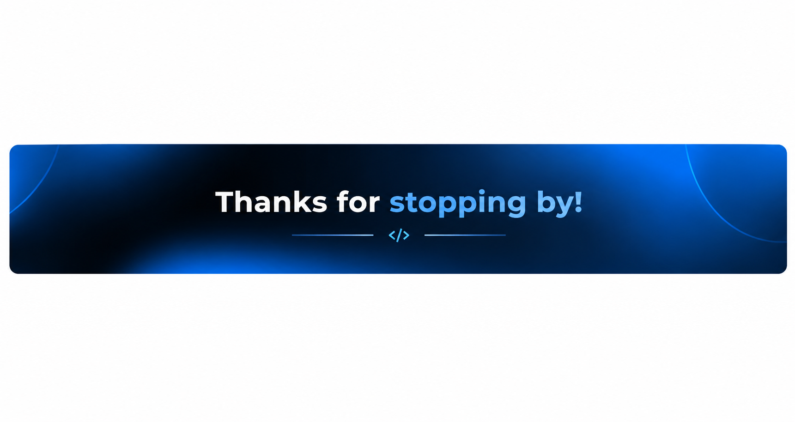

  

  

  

<h2 align="center">&lt;/&gt; ABOUT ME</h2>

<table>
  <tr>
    <td width="38%" align="center" valign="middle">
      
    </td>
    <td width="62%" valign="middle">
      

        <strong>✦ Computer Science Undergraduate focused on
        Software Development and AI-Powered Applications.</strong>
      

      

        <strong>✦ I enjoy building practical software solutions,
        exploring modern technologies, and transforming ideas
        into real-world applications.</strong>
      

      

        <strong>✦ Currently focused on developing software that
        integrates AI capabilities to solve meaningful and
        practical problems.</strong>
      

    </td>
  </tr>
</table>

  <tr>
    <td colspan="2">
      

        <strong>✦ I continuously strengthen my skills through
        hands-on projects, experimentation, problem-solving,
        and continuous learning.</strong>
      

      

        <strong>✦ Open to Internship and Placement Opportunities
        where I can contribute, learn, and grow as a
        Software Developer.</strong>
      

      

        <strong>
          Learn → Build → Experiment → Fail → Improve → Build Again
        </strong>
      

    </td>
  </tr>
</table>
==================================================== -->Technologies & Tools

  
  
  
  
  
  
  

 

  

